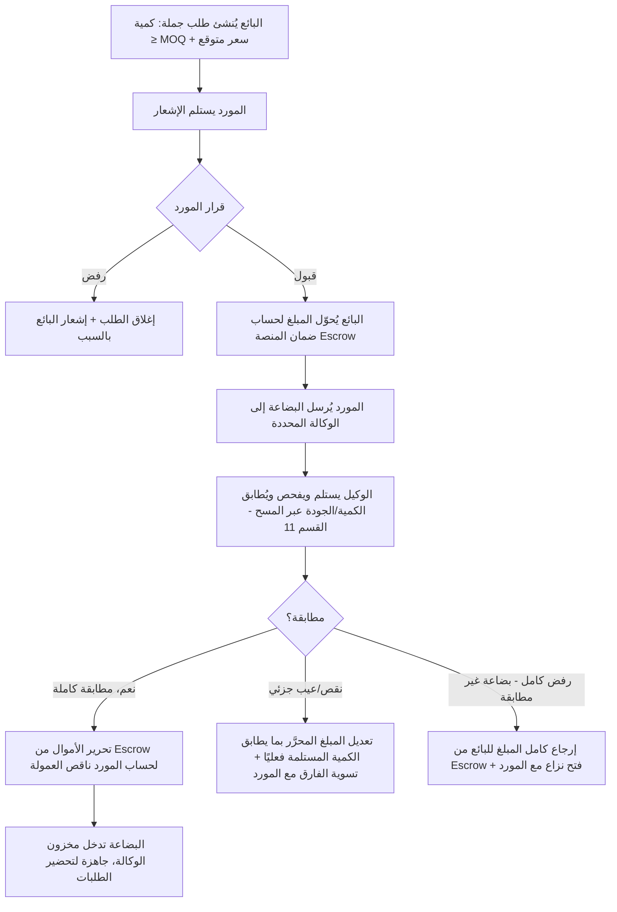
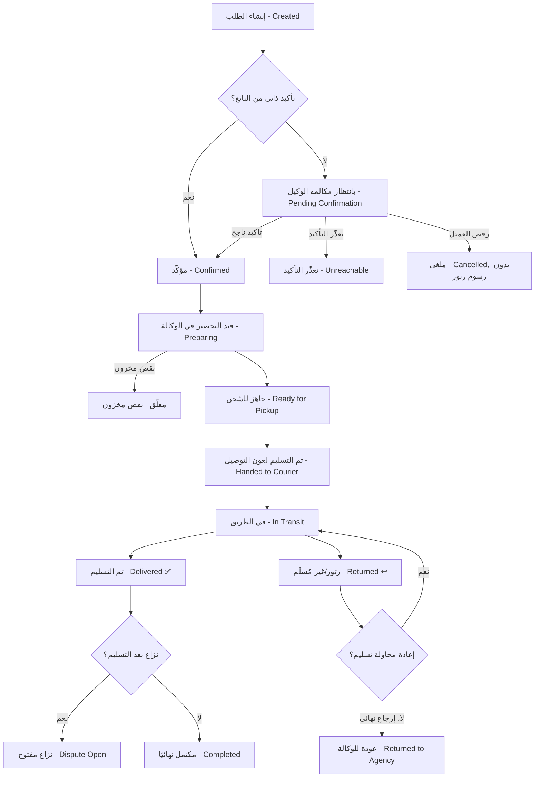

# TradeBridge — الفكرة الكاملة لمنصة تجارة إلكترونية (COD) في تونس

> **ملاحظة:** هذه الوثيقة تُطوّر وتُكمّل الفكرة الأصلية التي وُضعت لهذا المشروع. تمت إعادة تنظيمها، وتصحيح بعض التعارضات (مثل رموز الأدوار)، وإضافة الأجزاء الناقصة (الفواتير، الإشعارات، النزاعات، التقارير، تكامل شركات التوصيل، تفاصيل تقنية لأدوات المسح، جدول صلاحيات كامل...) حتى تكون مرجعًا واحدًا شاملًا بدون أي نقص، جاهزًا لتحويله لاحقًا إلى مخطط قاعدة بيانات ومواصفات تقنية (Backlog).
>
> **ملاحظة مهمة:** المنصة **لا تحتوي حاليًا على أي ميزة ذكاء اصطناعي**. كل عمليات المراجعة (المنتجات، الرسائل، الحسابات، النزاعات) تتم يدويًا من طرف بشر (الوكلاء/المدراء)، مع دعم تقني بسيط (فلاتر كلمات مفتاحية، مسح باركود/QR) لتسهيل العمل.

---

## جدول المحتويات

1. [الفكرة العامة والفلسفة](#1-الفكرة-العامة-والفلسفة)
2. [الأدوار ورموز أسماء المستخدمين](#2-الأدوار-ورموز-أسماء-المستخدمين)
3. [التسجيل والتحقق من الهوية (KYC)](#3-التسجيل-والتحقق-من-الهوية-kyc)
4. [دورة حياة المنتج](#4-دورة-حياة-المنتج)
5. [تصفح البائعين والسوق (Marketplace)](#5-تصفح-البائعين-والسوق-marketplace)
6. [إنشاء الطلبات (Commande) من طرف البائع](#6-إنشاء-الطلبات-commande-من-طرف-البائع)
7. [نظام المحادثات المراقَبة](#7-نظام-المحادثات-المراقبة)
8. [طلبات الجملة (Wholesale) وآلية الضمان (Escrow)](#8-طلبات-الجملة-wholesale-وآلية-الضمان-escrow)
9. [أدوار الوكيل وجدول الصلاحيات الكامل](#9-أدوار-الوكيل-وجدول-الصلاحيات-الكامل)
10. [نموذج العمولات والفوترة الجبائية](#10-نموذج-العمولات-والفوترة-الجبائية)
11. [نظام المسح بالباركود/QR داخل الوكالة](#11-نظام-المسح-بالباركودqr-داخل-الوكالة)
12. [إدارة المخزون متعدد المستودعات والوكالات](#12-إدارة-المخزون-متعدد-المستودعات-والوكالات)
13. [المحفظة الرقمية والسحب المالي](#13-المحفظة-الرقمية-والسحب-المالي)
14. [المتجر المستقل للبائع (White-Label Store)](#14-المتجر-المستقل-للبائع-white-label-store)
15. [تأكيد الطلب هاتفيًا قبل الشحن](#15-تأكيد-الطلب-هاتفيا-قبل-الشحن)
16. [رصيد ضمان الرتور (Retour Balance)](#16-رصيد-ضمان-الرتور-retour-balance)
17. [الصلاحيات والحوكمة العامة](#17-الصلاحيات-والحوكمة-العامة)
18. [نظام التذاكر (Tickets)](#18-نظام-التذاكر-tickets)
19. [دورة حياة الطلب الكاملة (Order Status Flow)](#19-دورة-حياة-الطلب-الكاملة-order-status-flow)
20. [تكامل شركات التوصيل](#20-تكامل-شركات-التوصيل)
21. [الإرجاع والنزاعات بعد التسليم](#21-الإرجاع-والنزاعات-بعد-التسليم)
22. [نظام الإشعارات](#22-نظام-الإشعارات)
23. [لوحات التحكم والتقارير (Dashboards & KPIs)](#23-لوحات-التحكم-والتقارير-dashboards--kpis)
24. [الأمان وحماية البيانات](#24-الأمان-وحماية-البيانات)
25. [جدول ملخص للرسوم والحدود المالية](#25-جدول-ملخص-للرسوم-والحدود-المالية)
26. [نموذج البيانات المقترح (الكيانات الأساسية)](#26-نموذج-البيانات-المقترح-الكيانات-الأساسية)
27. [التوصيات التقنية لأدوات المسح والطباعة](#27-التوصيات-التقنية-لأدوات-المسح-والطباعة)
28. [مراحل تطوير مقترحة](#28-مراحل-تطوير-مقترحة)
29. [ملاحظة ختامية](#29-ملاحظة-ختامية)

---

## 1. الفكرة العامة والفلسفة

**TradeBridge** منصة وسيطة إلكترونية تعمل بنظام **الدفع عند الاستلام (Cash On Delivery - COD)**، تربط بين:

- **الموردين/الشحّانين (Suppliers/Shippers)**: من يملكون المنتج فعليًا ويوفرونه بالجملة أو بالتفصيل.
- **البائعين (Sellers)**: من يسوّقون المنتجات على شبكات التواصل الاجتماعي (فيسبوك، إنستغرام، تيك توك...) دون الحاجة لتخزين أو شراء مسبق.
- **العملاء النهائيين (Customers)**: يستلمون الطلب ويدفعون عند التسليم.
- **الوكالات (Agencies)**: نقاط تخزين وتوزيع منتشرة جغرافيًا في تونس، تستلم البضاعة من الموردين، تُحضّرها، وتُسلّمها لشركات التوصيل.

### المبدأ الجوهري (Golden Rule)

> **المورد لا يعرف هوية البائع، والبائع لا يعرف هوية المورد.** كل تواصل (رسائل، طلبات جملة، تسليم بضاعة، تحويل أموال) يمر حصريًا عبر المنصة وتحت مراقبة الوكلاء.

هذا المبدأ يحمي المنصة من "التخطي" (Disintermediation) — أي اتفاق مباشر بين المورد والبائع خارج المنصة يفقدها عمولتها.

### أهداف المنصة

- تمكين أي شخص من بيع منتجات دون رأس مال أو مخزون (Dropshipping محلي بنظام COD).
- تمكين الموردين من الوصول لشبكة بيع واسعة دون الحاجة لبناء جمهور خاص بهم.
- ضمان جودة وموثوقية العملية اللوجستية عبر وكالات محلية ومسح دقيق للمنتجات.
- تحقيق دخل للمنصة عبر عمولات ثابتة (3% + 3%) ورسوم المتاجر المستقلة.

---

## 2. الأدوار ورموز أسماء المستخدمين

كل مستخدم جديد يختار دوره عند التسجيل. يُولَّد اسم المستخدم/المعرّف تلقائيًا بصيغة: **حرف واحد + 4 أرقام** (مثال: `S4821`). الأرقام تُولَّد تسلسليًا أو عشوائيًا مع ضمان عدم التكرار (Unique constraint في قاعدة البيانات).

> **تصحيح على الفكرة الأصلية:** كانت هناك تعارضات محتملة بين الحروف (P/L لتفادي الالتباس، وA مستخدم مرتين لـ Agent و Admin). الجدول أدناه هو **النسخة النهائية المعتمدة** بحروف فريدة 100% وواضحة بصريًا:

| الدور | الحرف | التسمية الكاملة | من يُنشئ الحساب |
|---|---|---|---|
| بائع | **S** | Seller | يُنشئه بنفسه (تسجيل ذاتي) + تفعيل من وكيل |
| مورد/شحّان | **F** | Fournisseur/Supplier | يُنشئه بنفسه (تسجيل ذاتي) + تفعيل من وكيل |
| وكيل | **A** | Agent | لا يُنشأ إلا من طرف المدير (Manager) |
| مدير وكالة | **M** | Manager | لا يُنشأ إلا من طرف الأدمن |
| أدمن/مدير عام | **D** | Director/Admin | حساب جذري (Root)، يُنشأ عند تهيئة المنصة فقط |
| سائق/منسّق تسليم داخل الوكالة | **L** | Livreur (منسّق التسليم الداخلي) | يُنشئه مدير الوكالة |
| عميل نهائي | **C** | Customer | يُنشأ تلقائيًا (سجل بيانات فقط، بدون تسجيل دخول/كلمة سر) عند إنشاء أول طلب باسمه |

> **ملاحظة على "الشحّان/Shipper":** في الفكرة الأصلية استُعمل مصطلح "Shipper" للإشارة إلى **المورّد** (من يملك المخزون ويشحنه للوكالة) وليس لسائق التوصيل. تم اعتماد هذا الفهم في كل الوثيقة: **Shipper = Supplier = المورّد**. أما سائق/عون التوصيل الخارجي (Aramex، First Delivery...) فهو موظف تابع لشركة التوصيل الخارجية ولا يملك حسابًا كاملاً في المنصة (فقط اسمه ورقم بطاقته يُسجَّلان كبيانات تسليم — انظر القسم 20).

### حالات الحساب (Account Status)

```
قيد الإنشاء (Draft) → قيد المراجعة (Pending Review) → نشط (Active)
                                                    ↘ مرفوض (Rejected, مع سبب)
نشط (Active) → معلّق مؤقتًا (Suspended, مع سبب وتاريخ انتهاء) → نشط
نشط (Active) → محظور نهائيًا (Banned, مع سبب) [قرار الأدمن فقط]
```

كل تغيير حالة يُسجَّل في **سجل تدقيق الحسابات (Account Audit Log)**: من قام بالتغيير، السبب، التاريخ.

---

## 3. التسجيل والتحقق من الهوية (KYC)

### بيانات التسجيل المطلوبة (بائع أو مورد)

| الحقل | إلزامي؟ | ملاحظة |
|---|---|---|
| الاسم الكامل | نعم | |
| رقم بطاقة التعريف الوطنية (CIN) | نعم | |
| صورة بطاقة التعريف — الوجه الأول | نعم | تُخزَّن مشفّرة |
| صورة بطاقة التعريف — الوجه الثاني | نعم | تُخزَّن مشفّرة |
| البريد الإلكتروني | نعم | يُستعمل للتنبيهات |
| رقم الهاتف | نعم | يُستعمل لتأكيد SMS/OTP وللمكالمات |
| اسم الشركة | اختياري | إن وُجد |
| الرقم الجبائي (Matricule Fiscal/Patente) | اختياري | يؤثر على من يتحمّل عمولة التسليم (انظر القسم 10) |
| العنوان | نعم | للمورد: عنوان المستودع الرئيسي |
| قبول الشروط والأحكام (Terms of Service) | نعم | مع طابع زمني وإصدار النسخة المقبولة |

### مسار التفعيل (Activation Workflow)

1. المستخدم يُنشئ الحساب ويختار دوره (بائع/مورد) ويملأ البيانات أعلاه.
2. الحساب يدخل حالة **"قيد المراجعة"** — لا يمكنه أي نشاط (لا إضافة منتج، لا إنشاء طلب).
3. وكيل مختص بـ"تفعيل الحسابات" يراجع: تطابق صورة البطاقة مع الاسم المُدخل، وضوح الصور، صحة رقم الهاتف/البريد (عبر رمز تحقق يُرسَل عند التسجيل).
4. القرار: **تفعيل** أو **رفض مع سبب واضح** (مثال: "صورة البطاقة غير واضحة، أعد الإرسال").
5. عند الرفض، يمكن للمستخدم تصحيح البيانات وإعادة الطلب دون إنشاء حساب جديد.
6. عند التفعيل، يستلم المستخدم إشعارًا (SMS + بريد) ويصبح يمكنه استخدام المنصة بالكامل.

### الخصوصية

- صور بطاقة التعريف تُخزَّن **مشفّرة (Encrypted at Rest)** ولا يمكن الوصول إليها إلا من طرف وكلاء لديهم صلاحية "تفعيل الحسابات" أو الأدمن، مع تسجيل كل عملية عرض (Access Log).
- بيانات الهوية لا تظهر أبدًا للطرف الآخر (مورد/بائع) في أي واجهة أو محادثة.

---

## 4. دورة حياة المنتج

### أ. إضافة المنتج من طرف المورد — كل الحقول التفصيلية

| الفئة | الحقول |
|---|---|
| **معلومات أساسية** | الاسم، الوصف الكامل، الفئة/التصنيف الرئيسي والفرعي، الوسوم (Tags) للبحث |
| **الوسائط** | صور متعددة (بلا حد أدنى/أقصى معقول، مثلاً حتى 10 صور)، **اختيار صورة رئيسية واحدة (Main Picture)** إلزامي، فيديو واحد أو أكثر (رابط مرفوع أو embed) |
| **المتغيرات (Variants)** | إن وُجدت: اللون، المقاس، وكل متغيّر له مخزون وسعر مستقل إن اختلف |
| **التسعير بالتفصيل** | Prix Détail — سعر بيع القطعة الواحدة |
| **التسعير بالجملة** | Prix Gros — عدة مستويات (Price Tiers)، كل مستوى له: **الكمية الدنيا (MOQ)** والسعر المقابل (مثال: 10-49 قطعة = 12د.ت، 50-99 = 10.5د.ت، 100+ = 9د.ت) |
| **الشحن** | الوزن (كغ)، الأبعاد (طول×عرض×ارتفاع) — ضرورية لحساب تكلفة التوصيل لاحقًا |
| **المخزون والمستودع** | الكمية الإجمالية المصرَّح بها، **المستودع (Depot)** الذي يخزَّن فيه المنتج (مورد بمستودع واحد أو أكثر يجب أن يحدد لكل كمية أي مستودع) |
| **الكود** | يُولَّد تلقائيًا من المنصة عند أول قبول (SKU داخلي)، لا يُدخله المورد يدويًا |
| **الحالة** | مسودة (Draft) → قيد المراجعة (Pending) → مقبول محليًا/شامل/مرفوض |

### ب. مراجعة الوكيل (Agent Review)

لكل منتج جديد أو **معدَّل بشكل جوهري** (تغيير السعر، الصور، الوصف — تغييرات طفيفة كخطأ إملائي لا تستدعي إعادة مراجعة)، الوكيل يختار من 3 قرارات:

1. **قبول في وكالة/متجر واحد فقط (Local Approval)**: يظهر فقط للبائعين المرتبطين بتلك الوكالة/المنطقة.
2. **قبول في كل الوكالات (Global/Whole Stores Approval)**: يظهر على مستوى المنصة كاملة، وهو **الشرط الوحيد** الذي يسمح للبائع بإضافته لمتجره المستقل (White-Label، القسم 14).
3. **رفض + سبب إلزامي (نص حر + قائمة أسباب جاهزة**: صور غير واضحة، سعر غير منطقي، منتج مخالف، وصف ناقص...**)**.

كل قرار يُسجَّل في **سجل تدقيق المنتجات (Product Audit Log)**: اسم الوكيل، التاريخ، الحالة السابقة/الجديدة، السبب.

### ج. ترقية/تخفيض حالة منتج مقبول محليًا

يمكن لوكيل آخر (أو وكيل مختلف بصلاحية أعلى) **ترقية** منتج من "قبول محلي" إلى "قبول شامل" لاحقًا بعد مراجعة أداء المبيعات أو الجودة، أو **تخفيضه/تعليقه** إذا ظهرت مشاكل (شكاوى متكررة، جودة رديئة).

### د. العروض (Deals)

المورد أو المنصة يمكنهما إنشاء **عرض مؤقت** على منتج: نسبة تخفيض أو سعر ثابت، تاريخ بداية/نهاية. العروض تظهر في قسم مخصص "العروض الحالية" في لوحة البائع.

---

## 5. تصفح البائعين والسوق (Marketplace)

لوحة تحكم البائع تعرض:

- **كتالوج المنتجات** مع فلاتر: الفئة، السعر (تفصيل/جملة)، الوكالة/المنطقة المتوفر فيها، التوفر في المخزون، الأحدث، الأكثر مبيعًا.
- **العروض الحالية (Deals)**.
- **عدد الموردين المتوفرين لكل فئة/منتج مشابه** (مؤشر تنافسية للبائع قبل تحديد سعره).
- **صفحة تفصيل المنتج**: كل الصور، الفيديو، أسعار التفصيل والجملة بمستوياتها، الوصف، التوفر في كل وكالة (بدون كشف هوية المورد أبدًا — يظهر فقط "مورد #F-XXXX" كمرجع داخلي غير قابل للتواصل المباشر).
- **قائمة المفضلة (Wishlist)** لحفظ منتجات للرجوع إليها.
- **مؤشر أداء المنتج** (اختياري): عدد مرات الطلب خلال آخر 30 يوم، نسبة الإرجاع التقريبية — يساعد البائع على اختيار منتجات موثوقة.

---

## 6. إنشاء الطلبات (Commande) من طرف البائع

البائع يسوّق خارج المنصة (فيسبوك/إنستغرام/تيك توك)، وعند حصوله على طلب فعلي من عميل، يُنشئ **أمر شراء (Commande)** بالحقول:

- **بيانات العميل**: الاسم الكامل، رقم الهاتف (رقم ثاني احتياطي مستحسن)، العنوان الكامل، الولاية، المعتمدية.
- **المنتج/المنتجات + الكمية لكل منتج**.
- **السعر الذي يبيع به البائع** لكل منتج (يحدد ربحه = سعر البيع − سعر المورد − العمولات).
- **طريقة التأكيد**: تأكيد ذاتي بالمكالمة أو ترك المهمة لوكيل المنصة (انظر القسم 15).

### قاعدة المستودع الواحد (Single-Depot Rule)

- إذا احتوى الطلب على منتجات متعددة، **يجب أن تكون كلها متوفرة في نفس المستودع (Depot)** كي يُشحن الطلب كوحدة واحدة من نقطة واحدة.
- إن رغب البائع بمنتجات من مستودعات مختلفة → **يُنشئ طلبات منفصلة**، طلب لكل مستودع.
- **خوارزمية اختيار المستودع** عندما يملك المورد نفس المنتج في أكثر من مستودع:
  1. إن حدد البائع مستودعًا صريحًا → يُستعمل.
  2. إن لم يحدد → النظام يقترح تلقائيًا **أقرب مستودع لعنوان العميل** (حسب الولاية) شرط توفر الكمية الكافية فيه.
  3. إن لم تتوفر الكمية الكافية في أي مستودع واحد → يُنبَّه البائع بالخيارات المتاحة (تقليل الكمية، أو تقسيم الطلب).

### تعديل/إلغاء الطلب

- يمكن للبائع تعديل الطلب (الكمية، العنوان، السعر) **فقط قبل مرحلة "التأكيد" أو "التحضير"**.
- بعد دخول الطلب في مرحلة "قيد التحضير"، أي تعديل يتطلب تدخل وكيل (إلغاء وإعادة إنشاء، أو تعديل يدوي مسجَّل).
- الإلغاء قبل الشحن لا يُكلّف رسوم رتور؛ الإلغاء بعد "تم التسليم لشركة التوصيل" يُعامَل كرتور عادي.

---

## 7. نظام المحادثات المراقبة

### أنواع المحادثات

1. **محادثة حول منتج معيّن** بين بائع ومورد.
2. **محادثة عامة عن الحساب** (استفسارات إدارية) بين مستخدم ووكيل الدعم.
3. **محادثة جملة (Wholesale)** مرتبطة مباشرة بطلب جملة معلّق.

### القاعدة الذهبية: إخفاء الهوية + مراجعة الوكيل

- لا يظهر اسم/هاتف/بريد/عنوان أي طرف للطرف الآخر أبدًا. يظهر فقط المعرّف (`S4821`, `F1190`).
- **كل رسالة** (نص، صورة، ملف) تذهب أولًا إلى **قائمة انتظار الوكيل (Moderation Queue)** قبل أن تُسلَّم فعليًا.
- إجراءات الوكيل الممكنة على كل رسالة:
  - **تمرير كما هي.**
  - **تحرير/حذف معلومات حساسة** (رقم هاتف، اسم، رابط خارجي، عنوان) قبل التمرير.
  - **رفض الرسالة بالكامل** مع إشعار المرسل بالسبب.
- **فلتر آلي أولي (Rule-Based، بدون AI)**: قائمة تعابير نمطية (Regex) تكتشف أرقام الهاتف (مثال: `\b\d{8}\b`)، الروابط الخارجية، أسماء منصات التواصل (فيسبوك، واتساب، إنستغرام) وتُعلّم الرسالة تلقائيًا كـ**"عالية الخطورة"** لتُعطى أولوية أعلى في قائمة الوكيل — لكن القرار النهائي يبقى بشريًا 100%.
- **مؤشر زمن الاستجابة**: يُقاس زمن انتظار كل رسالة في القائمة (SLA داخلي، مثلاً هدف أقل من ساعة عمل) لمراقبة كفاءة الوكلاء.
- **الإيقاف عند سوء الاستخدام**: تكرار محاولات إرسال معلومات تواصل مباشر (بعد 3 تحذيرات مثلاً) يؤدي إلى تعليق مؤقت لصلاحية المحادثة أو تصعيد للمدير.

---

## 8. طلبات الجملة (Wholesale) وآلية الضمان (Escrow)

### التسلسل الكامل



### تفاصيل إضافية

- **مهلة استجابة المورد**: إذا لم يرد المورد على طلب الجملة خلال مهلة محددة (مثلاً 48 ساعة)، يُعتبر الطلب **منتهي الصلاحية (Expired)** ويُغلق تلقائيًا.
- **حالة "قيد الشحن للوكالة"**: بعد قبول المورد، يبقى الطلب في هذه الحالة حتى يؤكد الوكيل استلام البضاعة فعليًا.
- **سجل Escrow**: كل حركة أموال (حجز، تحرير جزئي/كلي، إرجاع) تُسجَّل بتاريخ ومبلغ ومرجع الطلب.

---

## 9. أدوار الوكيل وجدول الصلاحيات الكامل

الوكيل (Agent) ليس دورًا واحدًا بل **حزمة صلاحيات** يوزّعها المدير حسب الحاجة. الصلاحيات الممكنة:

| الصلاحية | الوصف |
|---|---|
| `PRODUCTS_REVIEW` | قبول/رفض/ترقية المنتجات الجديدة والمعدَّلة |
| `ACCOUNTS_ACTIVATION` | مراجعة والموافقة على حسابات البائعين/الموردين الجدد |
| `CHAT_MODERATION` | مراجعة وتمرير/تعديل/رفض الرسائل |
| `ORDER_TRACKING` | متابعة كل الطلبات وحالاتها، التدخل عند مشكلة |
| `ORDER_CALL_CONFIRMATION` | الاتصال بالعملاء لتأكيد الطلبات |
| `AGENCY_STOCK` | استلام البضاعة، المسح، التغليف، التسليم لشركة التوصيل |
| `FINANCE_VIEW` | عرض تفاصيل الأموال والعمولات والـEscrow (بدون تنفيذ سحوبات) |
| `WITHDRAWAL_APPROVAL` | اعتماد طلبات السحب المالي — **حصريًا للمدير (Manager)**، ليس لأي وكيل عادي |
| `TICKETS_HANDLING` | معالجة تذاكر الدعم |
| `WHOLESALE_MODERATION` | متابعة طلبات الجملة والـEscrow |
| `DISPUTE_RESOLUTION` | معالجة النزاعات والإرجاعات بعد التسليم |

### جدول الصلاحيات حسب الدور (Role Permission Matrix)

| الصلاحية / الدور | Admin (D) | Manager (M) | Agent (A) — حسب التخصيص | Seller (S) | Fournisseur (F) |
|---|---|---|---|---|---|
| إنشاء حسابات وكلاء | ✅ (عبر تعيين مدير) | ✅ | ❌ | ❌ | ❌ |
| توزيع صلاحيات فرعية للوكلاء | ✅ | ✅ | ❌ | ❌ | ❌ |
| اعتماد السحب المالي | ✅ | ✅ (لوكالته فقط) | ❌ | ❌ | ❌ |
| مراجعة المنتجات | ✅ | ✅ | ✅ إذا مُنحت | ❌ (يقترح فقط) | ➕ (يضيف فقط) |
| مراقبة المحادثات | ✅ | ✅ | ✅ إذا مُنحت | ❌ | ❌ |
| تفعيل الحسابات | ✅ | ✅ | ✅ إذا مُنحت | ❌ | ❌ |
| إدارة مخزون الوكالة | ✅ | ✅ | ✅ إذا مُنحت | ❌ | ❌ (يصرّح بالكمية فقط) |
| الوصول لكل البيانات المالية على مستوى المنصة | ✅ | ❌ (وكالته فقط) | ❌ | ❌ | ❌ |
| إنشاء طلبات/محادثات/تذاكر | ✅ | ✅ | ✅ | ✅ | ✅ |

---

## 10. نموذج العمولات والفوترة الجبائية

### القاعدة الأساسية

- **3%** من قيمة الطلب تُخصم من **البائع**.
- **3%** من قيمة الطلب تُخصم من **المورد**.

### قاعدة الرقم الجبائي (Matricule Fiscal)

| الحالة | الوجهة |
|---|---|
| البائع **بدون** رقم جبائي | عمولته 3% تذهب لصالح **وكالة/عون التوصيل** (كإجراء حوكمة لتغطية الالتزامات الضريبية عن معاملة غير مُفوترة رسميًا باسم البائع) |
| البائع **بـ** رقم جبائي | يُنشأ الطلب مرتبطًا برقمه الجبائي (فاتورة رسمية باسمه)، والعمولة 3% تبقى إيرادًا للمنصة عاديًا |
| المورد **بدون** رقم جبائي | نفس المبدأ: عمولته 3% تذهب لعون التوصيل |
| المورد **بـ** رقم جبائي | تُنشأ فاتورة رسمية باسمه، والعمولة تبقى للمنصة |

### مثال حسابي كامل

طلب بقيمة بيع **100 د.ت** (السعر الذي حدده البائع للعميل)، والمورد يبيع نفس المنتج للبائع بسعر **70 د.ت** (سعر الجملة/التفصيل من المورد):

| البند | المبلغ |
|---|---|
| سعر البيع للعميل | 100.000 د.ت |
| سعر المورد (تكلفة البائع) | 70.000 د.ت |
| ربح البائع الخام | 30.000 د.ت |
| عمولة المنصة من البائع (3% من 100) | 3.000 د.ت — تذهب للمنصة إن كان له رقم جبائي، أو لعون التوصيل إن لم يكن له |
| عمولة المنصة من المورد (3% من 70، أو من 100 حسب السياسة المعتمدة) | 2.100 د.ت (على أساس 70) — نفس المنطق أعلاه |
| **ربح البائع الصافي** | 30.000 − 3.000 = **27.000 د.ت** |
| **صافي المورد** | 70.000 − 2.100 = **67.900 د.ت** |

> **قرار تصميمي يجب حسمه لاحقًا:** هل عمولة 3% تُحسب على "سعر بيع البائع" أم على "سعر المورد" أم على "الفارق (الربح)"؟ **التوصية**: تُحسب عمولة البائع على سعر بيعه للعميل (لأنه هو ما يمر عبر المنصة/COD)، وعمولة المورد على سعره الخاص (لأنه ما يستلمه). هذا يبسّط المحاسبة ويُطبَّق تلقائيًا عبر النظام.

### الفوترة (Invoicing)

- عند إتمام أي طلب، يُولَّد النظام تلقائيًا **فاتورة داخلية** (PDF) تحوي: تفاصيل المنتج، السعر، العمولة، الرقم الجبائي إن وُجد، رقم الطلب.
- الموردون/البائعون ذوو الرقم الجبائي يستلمون فواتير رسمية شهرية مجمّعة (Relevé) لأغراض التصريح الضريبي.
- المنصة تحتفظ بسجل محاسبي كامل (Ledger) لكل حركة مالية لأغراض التدقيق (Audit) والامتثال الضريبي.

---

## 11. نظام المسح بالباركود/QR داخل الوكالة

هذا قلب العملية اللوجستية، ويتكوّن من **3 مراحل مسح متتالية + استثناءات**، كل مرحلة تُنتج كودًا وتُسجَّل بالكامل (الوقت، الموقع GPS للوكالة، الوكيل، رقم الجهاز المستخدم).

### بنية الكود المقترحة

نظام ترميز موحّد بالبادئة (Prefix) لتفادي الالتباس بين الأنواع:

| نوع الكود | البادئة | مثال | مرتبط بـ |
|---|---|---|---|
| كود المنتج (وحدة/كرتونة) | `PRD-` | `PRD-000123456` | Product SKU + رقم تسلسلي فريد لكل وحدة أو دفعة (Batch) |
| كود الصندوق/الطرد | `BOX-` | `BOX-20260720-A03-000789` | يحوي تاريخ + رمز الوكالة + رقم تسلسلي |
| كود الوكالة | `AGY-` | `AGY-TUN-A03` | ثابت لكل وكالة |

يُستحسن استعمال **QR Code** (بدل Barcode خطي فقط) لأنه يحمل معلومات أكثر (كود + مرجع الطلب + رابط تحقق سريع) ويُقرأ بسهولة من كاميرا الهاتف حتى بجودة طباعة متوسطة.

### المرحلة 1 — الاستلام في المخزون (Stock-In)

1. عند وصول البضاعة من المورد للوكالة، الوكيل **يعدّ القطع يدويًا** ويقارن بالكمية المُعلَنة في طلب الجملة/التوريد.
2. يتحقق النظام: هل المنتج/الدفعة تملك كودًا مولَّدًا مسبقًا؟
   - **لا** → النظام يولّد كودًا فريدًا لكل قطعة أو لكل كرتونة (حسب سياسة المنتج: منتجات صغيرة الحجم تُرمَّز بالكرتونة، منتجات كبيرة/غالية تُرمَّز بالقطعة)، ويُطبَع على **ملصقات (Stickers)** عبر طابعة ملصقات، ثم تُلصَق يدويًا.
   - **نعم** → ينتقل مباشرة للمسح.
3. الوكيل يمسح كل كود بجهاز مسح (انظر القسم 27 للتفاصيل التقنية) — كل عملية مسح تُسجَّل:

```
product_code, batch_id, quantity_scanned, agency_id, agent_id,
warehouse_zone, gps_location, device_id, timestamp, action_type = "stock_in"
```

4. **حالة عدم التطابق (Mismatch)**: إذا كانت الكمية الممسوحة ≠ الكمية المُعلنة في طلب التوريد/الجملة، يُنشأ تلقائيًا **تنبيه عدم تطابق** يُصعَّد للمدير + يُشعَر المورد لتوضيح السبب (نقص في الشحنة، تلف...). هذا يؤثر مباشرة على تحرير أموال الـEscrow (القسم 8).
5. المخزون الرقمي للوكالة يتحدث فورًا (+ الكمية المستلمة فعليًا، لا المُعلنة).

### المرحلة 2 — التغليف/التجهيز للطلب (Boxing)

1. عند تحضير طلب لعميل، الوكيل يفتح "شاشة تحضير الطلب" (Pick List) ويمسح **كود كل منتج مطلوب** — النظام يتحقق من تطابق كل منتج ممسوح مع قائمة الطلب (تفادي خلط منتج بآخر).
2. إن مُسح منتج غير موجود في قائمة الطلب الحالي → تنبيه فوري صوتي/بصري "منتج خاطئ".
3. بعد تجميع كل منتجات الطلب في صندوق واحد، النظام **يولّد كود صندوق جديد (BOX-...)** يربط:

```
box_code ↔ order_id ↔ [قائمة product_codes بداخله] ↔ agency_id ↔ agent_id ↔ timestamp
```

4. يُطبع الكود كملصق شحن (يحوي أيضًا اسم/عنوان العميل مطبوعًا للناقل، دون بيانات المورد/البائع) ويُلصَق على الصندوق.
5. مسح تأكيدي للصندوق: `action_type = "boxed"`.
6. **حالة نقص عند التحضير**: إذا كانت الكمية المتوفرة فعليًا في الوكالة أقل من المطلوب (رغم ظهورها متوفرة في النظام)، الوكيل يُعلّم الطلب كـ"نقص مخزون" ويُصعَّد فورًا (يُشعَر البائع بخيار: الانتظار، التعديل، أو الإلغاء بدون رسوم رتور).

### المرحلة 3 — التسليم لشركة التوصيل (Handover)

1. عند تسليم الصندوق لعون التوصيل، يُمسح كود الصندوق مرة أخيرة.
2. يُنشأ **رقم تتبع خارجي (External Tracking Number)** عبر API شركة التوصيل (إن توفر)، ويُربط بـ `box_code`.
3. يُسجَّل: `action_type = "handed_to_courier"` + اسم شركة التوصيل + اسم/رقم عون التوصيل + الوقت + الوكالة.
4. حالة الطلب تتحول تلقائيًا إلى **"في الطريق (In Transit)"**.

### حالات استثنائية إضافية (أضيفت لضمان الشمولية)

| الحالة | الإجراء |
|---|---|
| منتج تالف يُكتشف عند الاستلام من المورد | يُمسح ويُعلَّم بحالة `damaged`، يُفصَل عن المخزون الصالح، يُشعَر المورد، لا يُحسَب في المخزون المتاح |
| فقدان/سرقة داخل الوكالة | تسجيل حادثة (Incident Report) بربط بكود المنتج آخر مرة تم مسحه فيها + من كان مسؤولًا عن تلك المنطقة وقتها |
| إرجاع من عميل (رتور) يعود للوكالة | مسح كود الصندوق عند الاستلام العكسي (`action_type = "returned_to_agency"`) ثم فحص المنتج: صالح لإعادة البيع (يُعاد للمخزون بكود منتج أصلي) أو تالف (يُعزَل) |
| تحويل بضاعة بين وكالتين | مسح خروج من الوكالة المصدر (`action_type = "transfer_out"`) ومسح دخول في الوكالة الوجهة (`action_type = "transfer_in"`) — انظر القسم 12 |

### جدول ملخص التتبع الكامل

| المرحلة | الكود المستعمل | البيانات المسجَّلة |
|---|---|---|
| استلام من المورد | `PRD-...` | الكمية، الوكالة، الوكيل، الوقت، حالة التطابق |
| تغليف في صندوق | `BOX-...` (جديد) | قائمة المنتجات، رقم الطلب، الوكيل، الوقت |
| تسليم لشركة التوصيل | `BOX-...` (مسح تأكيدي) | شركة التوصيل، عون التوصيل، رقم التتبع الخارجي، الوقت |
| إرجاع (عند الحاجة) | `BOX-...` أو `PRD-...` | سبب الإرجاع، حالة المنتج بعد الفحص |
| تحويل بين وكالات (عند الحاجة) | `PRD-...` | الوكالة المصدر/الوجهة، الوقت |

> هذا يضمن **تتبعًا كاملاً بلا ثغرات**: أي مسؤول يمكنه معرفة أين كان أي منتج بالضبط في أي لحظة.

---

## 12. إدارة المخزون متعدد المستودعات والوكالات

- المورد يمكنه التصريح بكمية إجمالية افتراضية على مستوى المنصة (Virtual Total Stock)، لكن الكمية الفعلية المتوفرة **فعليًا وجاهزة للشحن الفوري** قد تكون صفرًا أو محدودة في وكالة معيّنة.
- **نموذج "التحضير حسب الطلب" (Prepare-per-Order)**: عند كل طلب/طلب جملة جديد، المورد يُحضّر الكمية المطلوبة فقط ويرسلها للوكالة المعنية — لا يُشترط أن يكون كل الرصيد الافتراضي موجودًا فعليًا مسبقًا في الوكالات.
- النظام يعرض للوكيل/المدير مقارنة: **المخزون الافتراضي الإجمالي** مقابل **المخزون الفعلي الموجود حاليًا في كل وكالة** — أي فارق كبير وغير مبرَّر يُصعَّد كتنبيه (قد يدل على تأخر المورد في التوريد المتكرر).
- **مستودعات المورد المتعددة**: إذا كان للمورد أكثر من مستودع (فعلي عند المورد نفسه، قبل الدخول لأي وكالة)، يُصرَّح بكل مستودع كسجل مستقل (Depot Record) بعنوانه وكميته الخاصة بكل منتج. عند الطلب، يُطبَّق منطق القسم 6 (اختيار المستودع الأقرب/الأنسب).
- **مستودعات المورد داخل الوكالات**: إذا وزّع المورد بضاعته على أكثر من وكالة (Multi-Agency Stock)، كل وكالة تُدير مخزونها الفعلي المستقل لنفس المنتج، مع كود منتج فريد لكل دفعة تدخل كل وكالة (لضمان التتبع لكل وكالة على حدة).
- **تنبيهات المخزون المنخفض (Low Stock Alerts)**: تنبيه تلقائي للمورد والوكيل عندما ينخفض المخزون الفعلي في وكالة معيّنة تحت حد معيّن، لتفادي رفض الطلبات لاحقًا.
- **تسوية/جرد دوري (Stock Reconciliation)**: عملية جرد يدوي دورية (شهرية مثلًا) في كل وكالة لمقارنة السجل الرقمي بالعدّ الفعلي، وتسجيل أي فروقات مع تبريرها.

---

## 13. المحفظة الرقمية والسحب المالي

### المحفظة (Wallet)

كل بائع/مورد لديه محفظة برصيد مقسَّم إلى:

| نوع الرصيد | الوصف |
|---|---|
| **متاح (Available)** | يمكن سحبه فورًا |
| **محجوز (Reserved)** | مثل ضمان الرتور (القسم 16) أو مبالغ Escrow جملة قيد المعالجة |
| **معلّق (Pending)** | أرباح طلبات لم تُسلَّم/تُؤكَّد بعد (لم تتحول إلى "متاح" إلا بعد تأكيد التسليم) |

### أنواع حركات المحفظة (Ledger Entry Types)

`credit_sale` (ربح طلب مُسلَّم) · `debit_commission` (عمولة المنصة) · `debit_retour_reserve` (حجز ضمان رتور) · `credit_retour_release` (تحرير ضمان بعد التسليم) · `debit_withdrawal` (سحب) · `credit_escrow_release` (تحرير من ضمان جملة) · `debit_escrow_hold` (حجز لضمان جملة) · `debit_store_fee` (رسوم المتجر المستقل) · `debit_dispute_refund` (استرجاع بسبب نزاع)

كل حركة: `wallet_id, type, amount, related_order_id (اختياري), balance_after, timestamp, created_by`.

### السحب المالي — الفكرة الكاملة

**فقط مدير الوكالة (Manager)** يملك صلاحية اعتماد وصرف الأموال — لا الوكيل العادي.

#### النوع 1: تحويل بنكي (Virement Bancaire)

- الحد الأدنى: **20 د.ت** — الحد الأقصى: **10,000 د.ت** لكل عملية.
- استمارة تحوي: RIB/IBAN، اسم البنك، اسم صاحب الحساب (يجب أن يطابق اسم صاحب حساب المنصة)، المبلغ.

#### النوع 2: سحب نقدي (Cash/Retrait Espèces)

- الحد الأدنى: **200 د.ت** — الحد الأقصى: **10,000 د.ت** لكل عملية.
- يتطلب حضور المستخدم فعليًا للوكالة لاستلام المبلغ نقدًا.

#### خطوات موحّدة مفصَّلة لكل طلب سحب

1. المستخدم يفتح "طلب سحب" من محفظته، يختار النوع، يُدخل المبلغ (ضمن الحدود) والبيانات المطلوبة.
2. النظام يتحقق: الرصيد **المتاح** ≥ المبلغ المطلوب (لا يُحسب الرصيد المحجوز/المعلّق).
3. **فحوصات مضادة للاحتيال** (يدوية، بدون AI): مقارنة عدد/تكرار طلبات السحب الأخيرة، مطابقة اسم صاحب RIB مع بيانات KYC المسجَّلة، تنبيه إن كان الطلب أول سحب على حساب جديد بمبلغ كبير.
4. إرسال **رمز تحقق SMS (OTP)** صالح لمهلة محددة (مثلاً 5 دقائق، مع حد محاولات 3).
5. المستخدم يُدخل الرمز الصحيح → الطلب يدخل حالة **"بانتظار موافقة المدير"**، والمبلغ يصبح **محجوزًا (Reserved)** فورًا في المحفظة (لتفادي طلب سحب مضاعف لنفس الرصيد).
6. مدير الوكالة يراجع الطلب: تاريخ المستخدم، عدد الرتور السابقة، نسبة النزاعات، مبلغ السحب مقارنة بحجم مبيعاته — ويقرر **قبول** أو **رفض (مع سبب، يُعاد المبلغ لحالة "متاح")**.
7. عند القبول:
   - **بنكي** → تُنفَّذ العملية (تحويل حقيقي من طرف الإدارة أو بوابة دفع لاحقًا)، الحالة تتحول: `معتمد → قيد التحويل → مكتمل` (بعد تأكيد وصول التحويل بنكيًا)، والمبلغ يُخصَم نهائيًا من المحفظة.
   - **نقدي** → المبلغ يبقى "محجوز"، يُسلَّم فعليًا عند حضور المستخدم، وعندها فقط يُخصَم نهائيًا مع توليد **إيصال رقمي (Receipt Number)** وتوقيع/بصمة إلكترونية للمستخدم كإثبات استلام، أو تصوير لحظة التسليم.
8. **سجل كامل لكل عمليات السحب** (تاريخ، مبلغ، نوع، مدير معتمِد، حالة، رقم إيصال) متاح للمستخدم وللإدارة العليا، قابل للتصدير (PDF/Excel) لأغراض المحاسبة.
9. **مهلة انتظار الاستلام النقدي**: إذا لم يحضر المستخدم لاستلام سحبه النقدي المعتمد خلال مهلة معيّنة (مثلاً 15 يوم)، يُعاد المبلغ لحالة "متاح" تلقائيًا ويُشعَر المستخدم.

---

## 14. المتجر المستقل للبائع (White-Label Store)

- البائع يحصل على **مفتاح API (API Key)** خاص به من المنصة.
- فريق المنصة يُنشئ له متجرًا إلكترونيًا مستقلاً: **دومين + استضافة + تصميم أساسي جاهز**.
- **شرط الأهلية**: يمكنه اختيار فقط من المنتجات **المقبولة على مستوى المنصة بأكملها (Whole Stores)**.
- داخل متجره يمكنه تعديل: السعر المعروض (لا يقل عن حد أدنى يضمن هامش عمولة المنصة)، الوصف، ترتيب العرض، الصور المعروضة (من بين صور المنتج الأصلية المتاحة، لا يمكنه رفع صور جديدة غير معتمَدة من المورد).
- عند إنشاء عميل لطلب مباشرة من هذا المتجر، الطلب يُرسَل تلقائيًا لنظام المنصة عبر **Webhook** (`order.created`) ويسير في نفس مسار الطلبات العادية (تأكيد، تحضير، شحن...).

### أحداث Webhook المقترحة (API للبائع)

| الحدث | الوصف |
|---|---|
| `product.updated` | تحديث سعر/توفر منتج معتمَد على مستوى المنصة |
| `order.created` | طلب جديد من متجر البائع |
| `order.status_changed` | تغيّر حالة طلب (مؤكد، في الطريق، مُسلَّم، رتور) |
| `wallet.updated` | تحديث رصيد محفظة البائع |

### التسعير

| البند | السعر |
|---|---|
| اشتراك سنوي | 100 د.ت |
| اشتراك شهري (بديل) | 10 د.ت |
| لكل منتج يُضاف للمتجر | 0.255 د.ت |
| تخصيص/تصميم فاخر إضافي | حسب تذكرة دعم مخصَّصة تُقيَّم من الفريق التقني للمنصة |

- عدم تجديد الاشتراك (سنوي/شهري) في تاريخ الاستحقاق يؤدي إلى **تعليق المتجر مؤقتًا** (يبقى النطاق محجوزًا لمهلة إضافية قبل إلغائه نهائيًا).

---

## 15. تأكيد الطلب هاتفيًا قبل الشحن

- قبل إرسال أي طلب لشركة التوصيل، **وكيل المنصة يجب أن يتصل بالعميل** للتأكد من: المنتج، الكمية، العنوان، السعر النهائي.
- **نتائج المكالمة الممكنة**:
  - **مؤكَّد** → الطلب ينتقل لمرحلة "التحضير".
  - **لا يُرد** → إعادة محاولة حسب سياسة محددة (مثلاً 3 محاولات على مدى يومين)، ثم يُعلَّم "تعذّر التأكيد" ويُشعَر البائع.
  - **العميل غيّر رأيه/يريد تعديل العنوان أو الكمية** → يُحدَّث الطلب مباشرة قبل التحضير.
  - **العميل يرفض الطلب** → إلغاء فوري بدون رسوم رتور (لم يدخل مرحلة الشحن أصلاً).
- **استثناء "التأكيد الذاتي"**: إذا اختار البائع عند إنشاء الطلب خيار **"أكّدت الطلب بنفسي عبر مكالمتي"**، يتجاوز الطلب مرحلة اتصال الوكيل ويُرسَل مباشرة للتحضير — لكن يبقى مُعلَّمًا في السجل بأن **المسؤولية القانونية عن التأكيد كانت من طرف البائع**، وهذا يُستحضَر عند أي نزاع لاحق حول "طلب لم يطلبه العميل".

---

## 16. رصيد ضمان الرتور (Retour Balance)

- كل بائع يجب أن يملك **رصيدًا مسبقًا (Prepaid Reserve)** مخصصًا لتغطية تكلفة الرتور (الإرجاع عند عدم استلام العميل الطلب).
- تكلفة كل رتور = **5 د.ت**.
- **آلية الحجز**: عند إنشاء أي طلب "غير مُسلَّم بعد"، تُحجَز 5 د.ت افتراضيًا من رصيد الرتور (تنتقل من "متاح" إلى "محجوز" في المحفظة — القسم 13).
- مثال: بائع برصيد 20 د.ت في رصيد الرتور → يمكنه فتح **4 طلبات كحد أقصى** في وضعية "غير مُسلَّم بعد" في نفس الوقت.
- عند **التسليم بنجاح**: يُحرَّر الحجز تلقائيًا (يعود الـ5 د.ت إلى "متاح").
- عند **الرتور الفعلي**: يُخصَم الـ5 د.ت نهائيًا (تُدفَع لعون التوصيل حسب القسم 10).
- إذا نفد الرصيد المتاح، **لا يمكن إنشاء طلبات جديدة** حتى يشحن البائع محفظته (تنبيه واضح في الواجهة: "رصيد الرتور غير كافٍ، يرجى الشحن").
- **قابلية الشحن**: يمكن للبائع شحن رصيد الرتور من نفس محفظته العامة (تحويل داخلي بين الرصيد العام ورصيد الرتور المحجوز مسبقًا) أو عبر إيداع مباشر بالوكالة.

---

## 17. الصلاحيات والحوكمة العامة

| الدور | الصلاحيات العامة |
|---|---|
| **الأدمن (Admin/Director)** | وصول كامل لكل شيء: المستخدمين، الوكالات، الأموال على مستوى المنصة كاملة، الإعدادات، كل السجلات والتقارير |
| **المدير (Manager)** | يدير وكالة واحدة أو أكثر، يوزّع صلاحيات فرعية على الوكلاء، يعتمد السحوبات المالية لوكالته، يرى تقارير أداء وكالته فقط |
| **الوكيل (Agent)** | حساباته تُنشأ حصريًا من طرف المدير، بصلاحيات محددة له (القسم 9) |
| **البائع (Seller)** | ينشئ حسابه بنفسه، يخضع للتفعيل من وكيل |
| **المورد/الشحّان (Fournisseur)** | ينشئ حسابه بنفسه، يخضع للتفعيل من وكيل |
| **منسّق التسليم الداخلي (Livreur - L)** | ينشئه مدير الوكالة، يستلم الصناديق من الوكالة ويسلّمها فعليًا لعون شركة التوصيل الخارجية، يمسح الأكواد في المرحلة 3 (القسم 11) |

**تسلسل إنشاء الحسابات (Account Creation Chain)**:

```
حساب جذري Admin (يُهيَّأ عند إطلاق المنصة)
   → Admin يُنشئ حسابات Manager لكل وكالة
      → Manager يُنشئ حسابات Agent و Livreur لوكالته
Seller / Fournisseur → تسجيل ذاتي عام (لا يحتاج إنشاء من طرف أحد) + تفعيل من Agent
```

---

## 18. نظام التذاكر (Tickets)

- أي بائع أو مورد يمكنه فتح تذكرة تحوي: **السبب (Reason)** من قائمة مصنَّفة (مشكلة طلب، مشكلة مالية، مشكلة منتج، طلب تخصيص متجر، شكوى عامة...) + **الوصف التفصيلي** + مرفقات (صور/ملفات) اختيارية.
- التذكرة تُوجَّه تلقائيًا لوكيل مختص حسب التصنيف (مثلاً: تذاكر مالية → وكيل بصلاحية `FINANCE_VIEW`).
- **حالات التذكرة**: مفتوحة (Open) → قيد المعالجة (In Progress) → بانتظار رد المستخدم (Waiting on User) → مُجابة/مغلقة (Resolved/Closed).
- **مستوى الأولوية**: عادي، عاجل (مثلاً مشكلة مالية أو طلب معلَّق) — يحدَّد تلقائيًا حسب التصنيف أو يدويًا من الوكيل.
- سجل كامل للمحادثة داخل التذكرة بين المستخدم والوكيل، مع إمكانية تصعيد التذكرة للمدير إذا لم تُحل ضمن مهلة SLA محددة.
- تقييم المستخدم لجودة الحل بعد الإغلاق (رضا العميل الداخلي عن الدعم) — مؤشر داخلي لتقييم أداء الوكلاء.

---

## 19. دورة حياة الطلب الكاملة (Order Status Flow)



### حالات إضافية (أُضيفت لتغطية كل السيناريوهات الواقعية)

| الحالة | الوصف |
|---|---|
| `Unreachable` | تعذّر الوصول للعميل هاتفيًا بعد عدد محاولات محدد |
| `Stock Shortage` | نقص مخزون مكتشَف عند التحضير الفعلي (رغم ظهوره متوفرًا) |
| `Rescheduled` | العميل طلب تغيير موعد/محاولة تسليم لاحقة |
| `Dispute Open` | نزاع بعد التسليم (منتج تالف/خاطئ) — القسم 21 |
| `Returned to Agency` | البضاعة رجعت فعليًا للوكالة بعد رتور نهائي، جاهزة لفحصها وإعادة تصنيفها |

---

## 20. تكامل شركات التوصيل

- المنصة تتعامل مع **عدة شركات توصيل خارجية** (Aramex، First Delivery، وغيرها)، ويمكن لكل وكالة اختيار شريك/شركاء توصيل مختلفين حسب المنطقة.
- **جدول تكلفة التوصيل**: يُحدَّد حسب الوزن/الأبعاد (القسم 4) والمنطقة (الولاية) والناقل المختار — يُستعمل لحساب هامش البائع بدقة قبل تحديد سعره.
- **API/Webhook مع الناقل** (عند التوفر): مزامنة تلقائية لحالة الشحنة (استلمها الناقل، في الطريق، تم التسليم، رتور) عبر رقم التتبع الخارجي المرتبط بـ `box_code`؛ في غياب API، تحديث يدوي من الوكيل بناءً على تقرير الناقل.
- **أداء النقل**: تقرير دوري لكل ناقل (نسبة التسليم بالوقت، نسبة الرتور، عدد الحوادث) يساعد المدير على اختيار الناقل الأمثل لكل منطقة.
- **رسوم الرتور** (5 د.ت لكل طرف كما في القسم 16) تُدفَع لعون/شركة التوصيل بشكل ثابت، **دون أي عمولة نسبية إضافية** تؤخذ منها (القسم 10).

---

## 21. الإرجاع والنزاعات بعد التسليم

- إذا استلم العميل منتجًا تالفًا/خاطئًا وأراد الإرجاع بعد "تم التسليم"، البائع أو العميل (عبر البائع) يفتح **نزاع (Dispute)** مرتبط بالطلب.
- الوكيل المختص (`DISPUTE_RESOLUTION`) يراجع: صور المنتج المُرسَلة كإثبات، سجل المسح (كان المنتج سليمًا عند مغادرة الوكالة؟)، رواية البائع.
- **القرارات الممكنة**:
  - **قبول النزاع** → استرجاع كامل/جزئي لثمن المنتج للعميل عبر البائع (تسوية مالية Wallet: `debit_dispute_refund`)، والبضاعة المرجَعة تُفحَص عند عودتها للوكالة (القسم 11) لتحديد المسؤولية (تلف عند الشحن = مسؤولية الناقل، تلف من الأصل = مسؤولية المورد).
  - **رفض النزاع** → إشعار للبائع بالسبب، الطلب يُغلَق كـ"مكتمل".
- **معايير حظر تلقائي/تصعيد**: نسبة نزاعات مرتفعة متكررة لمورد أو بائع معيّن (مثلاً أكثر من X% من طلباته) تُصعَّد تلقائيًا للمدير لمراجعة الحساب (قد تؤدي لتعليق الحساب).

---

## 22. نظام الإشعارات

قناة إشعار مناسبة لكل نوع حدث، عبر (SMS / بريد إلكتروني / إشعار داخل التطبيق In-App):

| الحدث | القناة المقترحة |
|---|---|
| تفعيل/رفض الحساب | بريد + SMS |
| قرار مراجعة منتج (قبول/رفض) | In-App + بريد |
| رسالة جديدة تمت الموافقة عليها من الوكيل | In-App |
| قرار المورد على طلب جملة | In-App + SMS |
| تأكيد/فشل تأكيد طلب هاتفيًا | In-App |
| تغيّر حالة الطلب (شحن، تسليم، رتور) | In-App + SMS للحالات الحرجة (رتور) |
| رمز تحقق OTP (سحب مالي) | SMS (إلزامي) |
| قرار اعتماد/رفض طلب السحب | In-App + بريد |
| رد على تذكرة دعم | In-App + بريد |
| تنبيه مخزون منخفض (للمورد) | In-App + بريد |
| فتح نزاع/قرار نزاع | In-App + بريد |
| استحقاق تجديد اشتراك المتجر المستقل | بريد + SMS قبل الاستحقاق بأيام |

---

## 23. لوحات التحكم والتقارير (Dashboards & KPIs)

| الدور | مؤشرات لوحة التحكم |
|---|---|
| **Admin** | إجمالي المبيعات (GMV)، إيرادات العمولات، عدد الطلبات/الحالة، أداء كل وكالة، عدد الحسابات النشطة/قيد المراجعة، نسبة الرتور العامة، أفضل المنتجات/الفئات |
| **Manager** | أداء وكالته: طلبات قيد التحضير، مخزون الوكالة، السحوبات المعلَّقة، أداء الوكلاء التابعين له |
| **Agent** | قائمة مهامه اليومية حسب صلاحياته (منتجات للمراجعة، رسائل للمراجعة، مكالمات تأكيد معلَّقة، تذاكر مفتوحة) |
| **Seller** | مبيعاته، أرباحه، رصيد المحفظة ورصيد الرتور، أفضل منتجاته مبيعًا، نسبة الرتور الخاصة به، حالة متجره المستقل |
| **Fournisseur** | طلبات الجملة المعلَّقة، مخزونه الافتراضي والفعلي بكل وكالة، مبيعات منتجاته (بدون كشف هوية البائعين)، رصيد محفظته |

---

## 24. الأمان وحماية البيانات

- **إخفاء الهوية بين الأطراف** (مورد/بائع) مطبَّق على مستوى الـ API أيضًا، لا فقط الواجهة (لا تُعرض حقول هوية الطرف الآخر في أي استجابة API).
- **تشفير بيانات الهوية** (صور CIN) في التخزين (Encryption at Rest) وفي النقل (TLS).
- **صلاحيات وصول محددة (RBAC)** لكل صلاحية مذكورة في القسم 9، مع سجل وصول (Access Log) لكل استعراض لبيانات حساسة (بيانات هوية، بيانات مالية).
- **سجل تدقيق شامل (Global Audit Log)** لكل قرار إداري: مراجعة منتج، تفعيل حساب، اعتماد سحب، حل نزاع، تعديل رسالة — يشمل من نفّذ الإجراء والوقت والحالة قبل/بعد.
- **جلسات آمنة**: انتهاء صلاحية الجلسة بعد فترة خمول، تسجيل الدخول بكلمة سر + رمز SMS اختياري لعمليات حساسة (سحب مالي).
- **نسخ احتياطي دوري (Backups)** لقاعدة البيانات وسجلات المسح (لا يمكن التفريط في بيانات التتبع اللوجستي).

---

## 25. جدول ملخص للرسوم والحدود المالية

| البند | القيمة |
|---|---|
| عمولة المنصة من البائع | 3% من قيمة البيع |
| عمولة المنصة من المورد | 3% من قيمة المنتج |
| رسوم الرتور (لكل طرف بدون رقم جبائي) | 5 د.ت تذهب لعون التوصيل |
| حد أدنى/أقصى للتحويل البنكي | 20 د.ت — 10,000 د.ت |
| حد أدنى/أقصى للسحب النقدي | 200 د.ت — 10,000 د.ت |
| اشتراك المتجر المستقل (سنوي) | 100 د.ت |
| اشتراك المتجر المستقل (شهري) | 10 د.ت |
| رسم كل منتج يُضاف للمتجر المستقل | 0.255 د.ت |
| رصيد ضمان الرتور المطلوب لكل طلب معلَّق | 5 د.ت محجوزة لكل طلب |

---

## 26. نموذج البيانات المقترح (الكيانات الأساسية)

قائمة الكيانات الرئيسية (Entities) التي يجب أن تحتوي عليها قاعدة البيانات، كخطوة أولى نحو تصميم تقني مفصَّل لاحقًا:

`User` (المستخدم الأساسي: seller/fournisseur/agent/manager/admin/livreur، مع الدور والحالة) · `KYCDocument` · `Agency` · `Depot` (مستودع، مرتبط بمورد و/أو وكالة) · `Product` · `ProductVariant` · `ProductPriceTier` (الجملة والMOQ) · `ProductMedia` (صور/فيديو) · `ProductReview` (سجل قرارات الوكيل) · `Deal` · `Order` · `OrderItem` · `WholesaleRequest` · `ScanEvent` (كل عمليات المسح بأنواعها) · `Box` (الصندوق) · `Conversation` · `Message` (بحالة الموافقة/الرفض/التعديل) · `Wallet` · `WalletTransaction` · `WithdrawalRequest` · `RetourReserve` · `Ticket` · `TicketMessage` · `Dispute` · `Carrier` (شركة توصيل) · `DeliveryTracking` · `StoreSubscription` (المتجر المستقل) · `AuditLog`.

---

## 27. التوصيات التقنية لأدوات المسح والطباعة

### أجهزة المسح (Scanners)

- **جهاز مسح محمول مخصَّص (Handheld 1D/2D Scanner)** متصل عبر USB أو Bluetooth بتطبيق/جهاز الوكالة — الخيار الأنسب للاستعمال المكثف اليومي (سرعة، دقة، متانة).
- **بديل اقتصادي**: تطبيق ويب تدريجي (PWA) يستعمل كاميرا الهاتف/التابلت مع مكتبة مسح مفتوحة المصدر مثل `ZXing` أو `Quagga.js` أو `dynamsoft` — مناسب للوكالات الصغيرة أو كخيار احتياطي.
- يُفضَّل دعم **وضعية عدم الاتصال (Offline Mode)**: تسجيل عمليات المسح محليًا ومزامنتها عند استعادة الاتصال، لضمان استمرارية العمل في حال ضعف الشبكة بالوكالة.

### طابعات الملصقات (Label Printers)

- طابعات ملصقات حرارية مباشرة (Direct Thermal) مثل **Zebra ZD220/ZD421** أو **Brother QL-800** — لا تحتاج حبر، سريعة، مناسبة لطباعة أكواد QR/Barcode بكثافة.
- تصميم الملصق: كود QR/Barcode + نص مقروء للكود (Human-Readable) + شعار المنصة صغير + تاريخ الطباعة.

### تنظيم محطات العمل في الوكالة

1. **محطة الاستلام (Stock-In Station)**: جهاز مسح + طابعة ملصقات + شاشة عرض الكمية المتوقعة مقابل الممسوحة.
2. **محطة التحضير (Boxing Station)**: جهاز مسح + طابعة ملصقات (لكود الصندوق) + شاشة قائمة التحضير (Pick List) للطلب الحالي.
3. **محطة التسليم للناقل (Handover Station)**: جهاز مسح فقط (تأكيد قبل الخروج) + سجل توقيع عون التوصيل (رقمي أو ورقي مصوَّر).

---

## 28. مراحل تطوير مقترحة

بما أن المشروع واسع، يُقترح تقسيمه لمراحل تقنية متتالية بدل محاولة بناء كل شيء دفعة واحدة:

- **المرحلة 1 — الأساس**: تسجيل المستخدمين + KYC + الأدوار + إضافة/مراجعة المنتجات + السوق الأساسي (تصفح، بحث، فلترة).
- **المرحلة 2 — الطلبات واللوجستيك**: إنشاء الطلبات + قاعدة المستودع الواحد + دورة حياة الطلب + نظام المسح الكامل (3 مراحل) + تأكيد المكالمات.
- **المرحلة 3 — الأموال**: المحفظة الرقمية + العمولات + رصيد الرتور + السحب المالي (بنكي/نقدي) + الفوترة.
- **المرحلة 4 — التواصل والجملة**: المحادثات المراقَبة + طلبات الجملة والـEscrow + التذاكر.
- **المرحلة 5 — التوسّع**: المتجر المستقل (White-Label) + تكامل شركات التوصيل عبر API + النزاعات + لوحات التحكم والتقارير المتقدّمة.

---

## 29. ملاحظة ختامية

هذه المنصة **لا تحتوي حاليًا على أي ميزة ذكاء اصطناعي**. كل عمليات المراجعة (المنتجات، الرسائل، الحسابات، السحوبات المالية، النزاعات) تتم يدويًا من طرف وكلاء ومدراء بشريين، مع دعم تقني بسيط (فلاتر كلمات مفتاحية للرسائل، مسح باركود/QR للمخزون) يسهّل العمل دون أي أتمتة قائمة على الذكاء الاصطناعي. يمكن التفكير مستقبلاً في إضافة طبقة ذكاء اصطناعي (كشف احتيال تلقائي، تصنيف منتجات، ترجمة تلقائية للمحادثات) كمرحلة لاحقة اختيارية، لكنها **خارج نطاق هذا التصميم حاليًا**.
